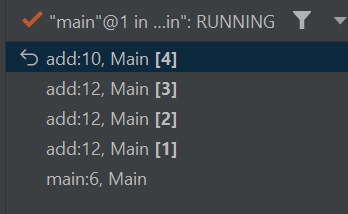

#  LeetCode challenges

## Datastructures

### Arrays

#### Time complexity:

Insert at the end: O(1)  
Access: O(1)  
Search: O(n)  
Remove: O(n)  

### LinkedList

#### Time complexity:

Insert: O(1)  
Access: O(n)  
Search: O(n)  
Remove: O(1)  

What are they used for in the real world?

- Next Page in Web Browser 
- Next image in a phone gallery.

Links:  
<a href="https://visualgo.net/en/list" alt="Visualisation LinkedList">Visualisation LinkedList</a>

### Stack

#### Time complexity:
Push: O(1)  
Pop: O(1)  
Top: O(1)  
Access (other): O(n)  

A stack follows the rule of LIFO (Last In First Out)
The last element added in the stack is the first element you remove from it.
Therefore, a stack is useful when you need the reverse
Order of given elements. A very popular example is
<em>Valid Parentheses Problem</em>.

What are they used for in the real world?
- Call history/log in mobile phones
- JVM
- Recursive function calls

Links:  
- <a href="https://csacademy.com/lesson/stack_introduction/" alt="What is a stack?">What is a stack?</a>
- <a href="https://csacademy.com/lesson/stack_application_soldiers_row/" alt="Stack Application: Soldiers Row">Stack Application: Soldiers Row</a>

## Space Complexity

Since the term <em>space complexity</em> is often misunderstood, I am trying to understand what it
actually means.

In many cases, the term <em>space complexity</em> refers to the <em>auxiliary space</em> required by an algorithm.

In fact, however, the <em>space complexity</em> of an algorithm
is the total space taken by the algorithm with respect
to the input size. This includes the <em>auxiliary space</em>
AND the space taken by the input.

Merge sort, Insertion sort and Heap sort 
all have a <em>space complexity</em> of O(n).
But Merge sort has an <em>auxiliary space</em>
of O(n),  while the others have only
O(1). In many cases, the <em>auxiliary space</em>
is a much better criterion than <em>space complexity</em>.


The creation of an array of length <em>n</em> requires
O(n) space. But also the recursive call stack space
counts! This means how many stack calls are on the stack at the same time!

Ex:

```
private static int add(int n) {      
    return (n == 0 || n == 1)  
            ? n  
             : n + add (n-1);
}

add(4);
```
If we use the debugger we can see, 
that the method uses up to four
stack calls at the same time:



Therefore, the auxiliary space here is
O(n). 

It is important to mention that the <em>n</em> calls
exist simultaneously on the call stack!

There are functions/methods that use recursion where
the input size is <em>n</em>, but there is at most
one call on the call stack. Therefore the
auxiliary space is only O(1)!


## Techniques

#### Storage of two values in one variable:

Let's say we want to store two values <em>a</em>
and <em>b</em> in one variable <em>c</em>.

- Why would we want to do that?

Sometimes we want to reduce the space complexity. 
Suppose we have an array of length <em>n</em> and we want to manipulate the entries. 
One possibility would be to change the entries directly, but this is not always possible. 
Sometimes the new manipulated value depends on other old (not yet manipulated) values in the array. 
An example of this is the BuildArrayFromPermutation task:

<em>Given a zero-based permutation nums (0-indexed), build an array ans of the same
length where ans[i] = nums[nums[i]] for each 0 <= i < nums.length and return it.  

A zero-based permutation nums is an array of distinct integers from 0 to nums.length - 1 (inclusive).</em>

Here it is not so easy to manipulate the input array nums directly.  

Ex:   
<em>Let nums = [2,0,1]. 

Then:    
1.Step: nums[0] = nums[nums[0]] = nums[2] = 1  
2.Step: nums[1] = nums[nums[1]] = nums[0] = 1
...

So instead we could use a second array ans
of length n with ans[i] = nums[nums[i]],
which results in an auxillary space complexity
of O(n). But that's not what we want!
</em>

- How to do that?  

We can simply use modulo! So we define <em>c = a+n*b</em>
where <em>a, b < n</em>. With that we get <em> a == c%n</em>
and <em>b == c/n</em> where we assume
<em>a/n == 0</em> (which is true for integer calculations).  

This is one way to solve th BuildArrayFromPermutation task
with an auxillary space complexity of O(1).

#### Two Pointers:

- When to use it?

You are trying to solve an array-related problem where the goal is to find two numbers
that satisfy a certain condition.

- What is the general idea?

The idea is to iterate two different parts of an array simultaneously
to get an answer faster.

- How does the implementation look like?

There are at least two ways of implementing the two-pointer technique:

1. One pointer at each end: One pointer starts from the beginning
and another one fom the end. They proceed towards each other.

    Ex: existsPairWithGivenSumForSortedArray, reverseArray


2. Both pointers start at the same position, but with move with different speed:
 
    Ex: MiddleOfLinkedList

## Sort Algorithm

### QuickSort

How to retain sort algorithm ideas?

- <a href="https://medium.com/analytics-vidhya/investigating-quick-sort-partitioning-c70b4240cf4b" alt="What is a stack?">Investigating quick sort partitioning</a>

- Write down your thoughts! Step by step!


1. What is the core idea?
    - <em>Pivot</em>: Choose a <em>pivot</em> (an element of the array).
    - <em>Partition</em>: Put all the elements less the pivot on one side and all elements 
      greater on the other (<em>partitioning</em>).


2. Write down a simple example!  
   [2, 7, 6, 1, 4], pivot = 4 => [2, 1, 4, 7, 6]


3. Write down "given, wanted":
   - <em>Given</em>: A random array with elements e1, e2,..., pivot
   - <em>Wanted</em>: A partition with [e1, e2, ..., pivot, e5, ..] where e1, e2, ... < pivot < e5, ...

4. No idea how to start? Ask questions about the core ideas to find some <em>key steps</em>!
   These can be the simplest questions at the beginning!
   Two questions are particularly important:
   - How to perform/what do we need to find?
   - What does it mean?  
   If you get stuck with one of the two questions, ask the other!
   It is important that the answers do not have to be perfect, i.e. if something is too complex to be answered 
   in an easily comprehensive way, then an incomplete answer is ok. 
   This is just a brainstorming session to find some small possible key steps to get started solving the problem.
   What does the problem actually means? What are we looking for? What are some really basic key steps we need to perform?
   Variables? Iteration? Functions? What is the minimum required to perform our/parts of our task?
   <br/><br/>
   Write down the questions and answers e. g. we need a boundary. Write down 
   what a boundary is! <br/> <br/>
   Questions: No ideas? Well write down the most obvious question!</p>
   - How to perform a partition? We pick a pivot e. g. last element of the array.
   - What does partitioning mean/do/create? Separate an array in "two arrays"
     with an element in the middle [e1, e2,...] boundary [e5, ...]. 
     => A partition creates a boundary! A boundary where all elements to the left of the boundary
     are smaller than the pivot element and all elements to the right are larger.
     The boundary is an index in the array that we need to find.
   - We need to find a boundary. So we need a <em>variable boundary</em>.
   - How to find a boundary? No idea.
   - What is a boundary? A boundary is an index in the array! So we need to find an index in the array!
   - What is the minimum required to find the boundary? What are key steps?
     We need to compare each element with the pivot. And for this
     we have to iterate through the array! So two key steps are:
     - <em>comparison of elements</em>
     - <em>iteration through array</em>


5. While performing step 4 create a separate list with key step ideas!  <br/> <br/>
   Key steps ideas:
    - Pick a pivot e. g. last element.
    - Init a variable <em>boundary</em>.
    - Iterate through array
    - Comparison of elements with pivot


6.  How would you approach the problem now if you were to do it by hand? Try it out with an example and using 
    the key steps ideas! Try to go through an example, even if you don't know how at first. Describe the steps and 
    write them down in words! Meanwhile, write down possible steps from the algorithm in words!
    <br/> <br/>
    Example: nums = [2,7,6,1,4], pivot = 4  
    We need to iterate through the array and we need to init the boundary.
    We init the boundary with the first element in the array and start iterating.  
    Possible steps: 
    - Set boundary to first element
    - Start iterating
    <br/> <br/>
    boundary = 0, i = 0, nums[i] = 2, nums[boundary] = 2
  